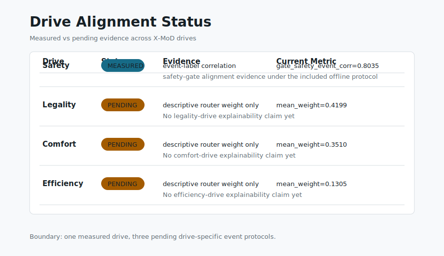
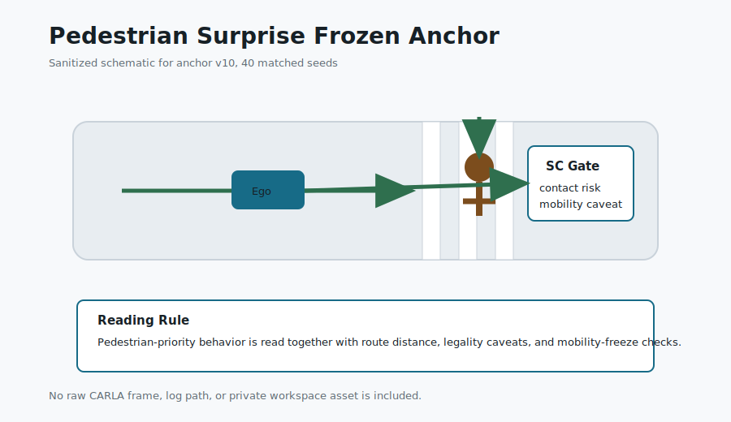

# lloitesa013

**I build judgment layers for AI systems.**

My work focuses on systems that make model decisions traceable, safely gated,
user-governed, and evidence-bound. I do not build more impressive AI outputs;
I build reference architectures that test whether AI outputs and claims can be
trusted, scoped, reviewed, and sealed as evidence.

## 30-Second Map

- **Face:** Cognitive OS, a decision verification protocol above LLMs.
- **Evidence discipline:** Financial Agent Evidence OS, a claim and release-gate
  system for financial AI agents.
- **Research roots:** X-MoD and Angelos OS, autonomous-driving judgment-layer
  research.
- **Next work:** deepen the existing demos and evidence kits before starting new
  projects.

## Final Standard

**Works. Reproducible. Measured. Understandable. Bounded.**

The public portfolio should not rely on "I am impressive" as a claim. It should
show running code, reproducible evidence, measurable gates, clear explanations,
and visible limits.

Read: [Verification Principles](VERIFICATION_PRINCIPLES.md)

## Proof at a Glance

| Work | It works | Reproducible | Measured | Boundary |
| --- | --- | --- | --- | --- |
| [Cognitive OS API](https://github.com/lloitesa013/cognitive-os-api) | FastAPI evidence viewer and `/evidence/report` | Seed benchmark, baselines, conformance, adversarial runner | Gate accuracy 100%, trace completeness 100%, adversarial redaction pass 100% | Not AGI, not global LLM safety, not complete safety |
| [Financial Agent Evidence OS](https://github.com/lloitesa013/stock-agent-harness-v0-2-0-defense) | Streamlit evidence viewer and release gates | Full unit suite plus release/audit/verifier commands | `118 tests OK`, 2 skipped; release comparison and tamper walkthrough | Not financial advice, not live trading, not future-return prediction |
| [X-MoD Visual Paper Kit](research/xmod-visual-paper-kit/README.md) | Public visual packet and renderer | Sanitized CSV plus validation script | `gate_safety_event_corr=0.8035`; safety measured, other drives pending | Offline protocol evidence only |
| [Angelos Reproducibility Kit](research/angelos-reproducibility-kit/README.md) | Public packet validator | Frozen anchors and manifest checks | `ped_surprise/v10`, `merge_cutin/v11`, 40 seeds each | CARLA protocol packet, not deployment readiness |

## Flagship Work

### Cognitive OS API

**A decision verification protocol above LLMs.**

- Compiles user/profile policy into a Cognitive Configuration Profile.
- Analyzes candidate model output before it becomes an action.
- Emits `ALLOW`, `DEGRADE`, `DENY`, or `HANDOFF` decision envelopes.
- Redacts public traces by default; raw traces require explicit local opt-in.

Repo: [cognitive-os-api](https://github.com/lloitesa013/cognitive-os-api)

### Financial Agent Evidence OS

**A claim-governed evidence system for financial AI agents.**

- Verifies scoped benchmark claims with evidence manifests and release gates.
- Preserves non-claims around financial advice, live trading readiness, and
  future-return guarantees.
- Treats unfavorable evidence as part of the record, not something to hide.

Repo: [stock-agent-harness-v0-2-0-defense](https://github.com/lloitesa013/stock-agent-harness-v0-2-0-defense)

## Research Lineage

My current systems grew out of a single question:

> How can an AI system decide, restrain, explain, and verify its actions under
> explicit human values?

The lineage is:

1. **Flow-Based AI Ethics Model**: ethical cognition as a decision flow.
2. **X-MoD**: explainable routing over explicit driving values.
3. **Angelos OS**: safety-gated judgment above autonomous driving policies.
4. **Cognitive OS**: user-owned policy and decision gates above LLMs.
5. **Evidence OS**: benchmark and release gates for claims made by agents.

Read more: [AI Judgment Lineage](AI_JUDGMENT_LINEAGE.md)

## Autonomous Driving Research Line

X-MoD and Angelos OS are the research roots of this portfolio. They test the same
judgment-layer idea in a harder setting: autonomous driving, where action,
restraint, explanation, and failure analysis must be tied to scenario evidence.

- **X-MoD:** explainable routing over safety, legality, comfort, and efficiency.
- **Angelos OS / SynOptic Core:** a model-agnostic judgment layer above driving
  policies, with safety gates and protocol-frozen evaluation.
- **Public kits:** [X-MoD Visual Paper Kit](research/xmod-visual-paper-kit/README.md)
  and [Angelos Reproducibility Kit](research/angelos-reproducibility-kit/README.md).
- **Boundary:** these kits are sanitized research packets, not broad safety or
  deployment claims.

## Portfolio Map

- [AI Verification Portfolio](AI_VERIFICATION_PORTFOLIO.md)
- [AI Judgment Lineage](AI_JUDGMENT_LINEAGE.md)
- [Verification Principles](VERIFICATION_PRINCIPLES.md)
- [Product Map](PRODUCT_MAP.md)
- [Public / Private Split](PUBLIC_PRIVATE_SPLIT.md)
- [Research Kits](research/README.md)

## Proof Surface

Python - FastAPI - Streamlit - CI gates - benchmark harnesses - evidence
manifests - release gates - decision envelopes - trace privacy

## Claim Boundary

This portfolio does not claim external adoption, global SOTA status, AGI,
live trading readiness, investment performance, complete AI safety, or any
unbounded guarantee. Claims are scoped to the included reference architectures,
benchmark suites, and published evidence artifacts.
